# Natural Language Search in Jaeger - Step-by-Step Flow

## How AI Transforms Your Questions into Trace Searches

```mermaid
graph TD
    %% Step 1: User Input
    USER[👤 User]
    QUERY["💬 Types Query:<br/>'show slow requests in payment service'"]
    
    %% Step 2: Jaeger UI
    UI[🖥️ Jaeger UI<br/>Search Interface]
    
    %% Step 3: AI Backend
    BACKEND[🤖 AI Backend<br/>Receives Query]
    
    %% Step 4: Language Model Processing
    LLM[🧠 Language Model<br/>Analyzes Intent]
    
    %% Step 5: Intent Extraction
    INTENT[🎯 Intent Extraction<br/>Identifies Key Information]
    
    %% Step 6: Parameter Conversion
    CONVERT[⚙️ Convert to Jaeger Filters<br/>Structured Search Parameters]
    
    %% Step 7: Jaeger Query
    JAEGER[🔍 Jaeger Query Service<br/>Executes Search]
    
    %% Step 8: Results
    RESULTS[📊 Matching Traces<br/>Found and Returned]
    
    %% Step 9: Display
    DISPLAY[✨ UI Shows Results<br/>Filtered Trace List]

    %% Flow connections
    USER --> QUERY
    QUERY --> UI
    UI -->|"1. Send natural language query"| BACKEND
    BACKEND -->|"2. Forward to AI"| LLM
    LLM -->|"3. Analyze and understand"| INTENT
    INTENT -->|"4. Extract parameters"| CONVERT
    CONVERT -->|"5. Generate search filters"| JAEGER
    JAEGER -->|"6. Execute search"| RESULTS
    RESULTS -->|"7. Return matching traces"| DISPLAY
    DISPLAY -->|"8. Show filtered results"| USER

    %% Styling
    classDef user fill:#e3f2fd,stroke:#1976d2,stroke-width:2px
    classDef ui fill:#f3e5f5,stroke:#7b1fa2,stroke-width:2px
    classDef backend fill:#fff3e0,stroke:#f57c00,stroke-width:2px
    classDef ai fill:#e8f5e8,stroke:#388e3c,stroke-width:2px
    classDef process fill:#fff8e1,stroke:#fbc02d,stroke-width:2px
    classDef jaeger fill:#fce4ec,stroke:#c2185b,stroke-width:2px
    classDef results fill:#e0f2f1,stroke:#00796b,stroke-width:2px

    class USER,QUERY,DISPLAY user
    class UI ui
    class BACKEND backend
    class LLM,INTENT ai
    class CONVERT process
    class JAEGER jaeger
    class RESULTS results
```



## Detailed Step-by-Step Breakdown

### Step 1: 💬 User Types Natural Language Query
```
User Input: "show slow requests in payment service"
Location: Jaeger UI search bar
```

### Step 2: 🖥️ Jaeger UI Captures Query
```
Action: UI receives the natural language text
Next: Sends query to AI Backend via API call
```

### Step 3: 🤖 AI Backend Receives Query
```
Receives: Raw natural language string
Prepares: Query for Language Model processing
```

### Step 4: 🧠 Language Model Analyzes Intent
```
AI Processing: Understanding what the user wants
- Identifies: "slow requests" = performance issue
- Identifies: "payment service" = specific service
- Identifies: Missing time range = use default
```

### Step 5: 🎯 Intent Extraction Results
```
Extracted Information:
✓ Service Name: "payment"
✓ Performance Filter: "slow" (duration > threshold)
✓ Request Type: HTTP requests (inferred)
✓ Time Range: Default (last 1 hour)
```

### Step 6: ⚙️ Convert to Jaeger Search Filters
```
AI Output → Jaeger Parameters:
{
  "service": "payment",
  "minDuration": "500ms",
  "tags": {
    "span.kind": "server"
  },
  "lookback": "1h",
  "limit": 20
}
```

### Step 7: 🔍 Jaeger Query Service Executes Search
```
Action: Search traces using structured parameters
Database: Queries trace storage with filters
```

### Step 8: 📊 Matching Traces Returned
```
Results: List of traces that match all criteria
- Service = "payment"
- Duration >= 500ms
- From last hour
```

### Step 9: ✨ UI Displays Filtered Results
```
User Sees: Clean list of slow payment service traces
Benefit: No need to learn Jaeger query syntax
```

## Intent Mapping Examples

### Example 1: Performance Query
| **Natural Language** | **AI Understands** | **Jaeger Filters** |
|---------------------|-------------------|-------------------|
| "slow database calls" | service=database, performance=slow | `minDuration: "500ms"`, `tags: {"db.type": "*"}` |

### Example 2: Error Query
| **Natural Language** | **AI Understands** | **Jaeger Filters** |
|---------------------|-------------------|-------------------|
| "errors in checkout" | service=checkout, status=error | `service: "checkout"`, `tags: {"error": "true"}` |

### Example 3: Time-based Query
| **Natural Language** | **AI Understands** | **Jaeger Filters** |
|---------------------|-------------------|-------------------|
| "requests from last 30 minutes" | time=30min, type=requests | `lookback: "30m"`, `tags: {"span.kind": "server"}` |

### Example 4: HTTP Method Query
| **Natural Language** | **AI Understands** | **Jaeger Filters** |
|---------------------|-------------------|-------------------|
| "POST requests to user service" | method=POST, service=user | `service: "user"`, `tags: {"http.method": "POST"}` |

## What Makes This Work?

### 🎯 **Intent Recognition**
The AI identifies what you're looking for:
- **Performance**: "slow", "fast", "timeout"
- **Errors**: "error", "failed", "exception"
- **Services**: "payment", "checkout", "user"
- **Time**: "last hour", "today", "yesterday"

### 🔄 **Smart Defaults**
When information is missing, AI applies sensible defaults:
- No time range → Last 1 hour
- "Slow" → Duration > 500ms
- "Requests" → HTTP server spans

### 🧠 **Context Understanding**
AI understands relationships:
- "Database calls" → Look for database spans
- "API requests" → Look for HTTP spans
- "Service errors" → Look for error tags

## Benefits for Users

### ✅ **No Learning Curve**
- Type questions like you'd ask a colleague
- No need to memorize Jaeger query syntax
- Instant results without documentation

### ✅ **Faster Debugging**
- Get to relevant traces immediately
- Focus on problem-solving, not query building
- Reduce time from question to answer

### ✅ **Team Accessibility**
- Anyone can search traces effectively
- Reduces dependency on Jaeger experts
- Democratizes observability data

## Common Query Patterns

### 🔍 **Performance Queries**
```
"show slow requests"
"find timeouts in API"
"database calls taking more than 1 second"
```

### 🚨 **Error Queries**
```
"show me errors in payment service"
"failed requests from last hour"
"exceptions in checkout flow"
```

### 📊 **Service-Specific Queries**
```
"all requests to user service"
"payment service activity today"
"frontend service errors"
```

### ⏰ **Time-Based Queries**
```
"requests from last 30 minutes"
"errors since yesterday"
"slow calls this morning"
```

---

**This natural language search makes Jaeger accessible to everyone on your team, turning complex trace queries into simple conversations.**