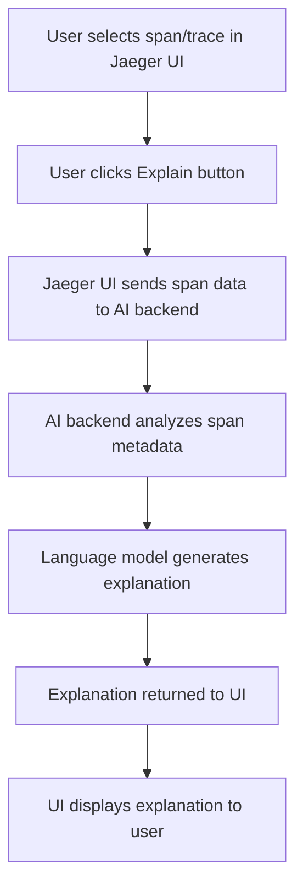

# Explain Span/Trace Feature - Simple Technical Flow

## Basic Flowchart

## Step-by-Step Process

1. **User selects span/trace in Jaeger UI**
   - User clicks on a span in the trace timeline

2. **User clicks Explain button**
   - Explain button appears near the selected span

3. **Jaeger UI sends span data to AI backend**
   - POST request with span metadata (tags, logs, duration)

4. **AI backend analyzes span metadata**
   - Extracts relevant information from span data

5. **Language model generates explanation**
   - AI processes the metadata and creates human-readable text

6. **Explanation returned to UI**
   - Backend sends formatted explanation back to frontend

7. **UI displays explanation to user**
   - User sees plain English explanation of the span