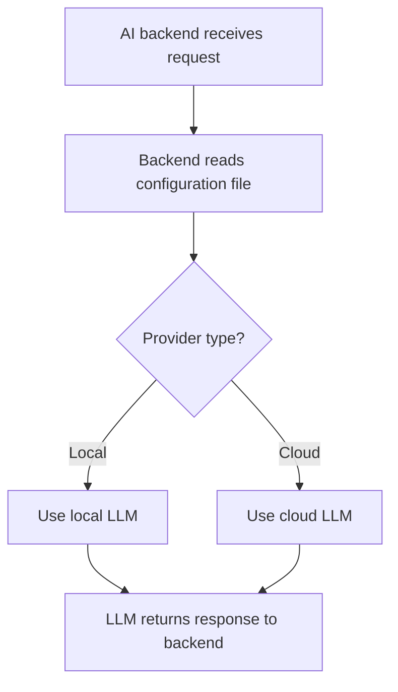

# LLM Provider Selection - Simple Technical Flow

## Basic Flowchart

## Step-by-Step Process

1. **AI backend receives request**
   - Request comes from Jaeger UI for query translation or span explanation

2. **Backend reads configuration file**
   - Checks config.yaml for LLM provider setting

3. **Provider type decision**
   - If provider is "ollama" → Use local LLM
   - If provider is "openai" or "anthropic" → Use cloud LLM

4. **Use local LLM**
   - Connect to Ollama server (localhost:11434)
   - Send request to local model

5. **Use cloud LLM**
   - Connect to cloud API (OpenAI/Anthropic)
   - Send request with API key

6. **LLM returns response to backend**
   - Both local and cloud LLMs return processed response
   - Backend continues with business logic